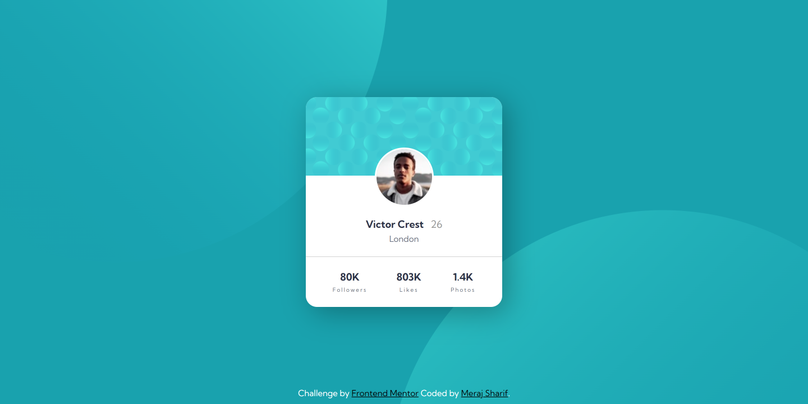

# Frontend Mentor - Profile card component

## Table of contents

- [Screenshot](#screenshot)
- [Links](#links)
- [Built with](#built-with)
- [Author](#author)

### Screenshot

### Links

- Solution URL: [solution URL](https://www.frontendmentor.io/solutions/frontend-mentor-profile-card-component-html-css-bem-VtMKF2Aret)
- Live Site URL: [live site URL](https://meraj-sharif-khan.github.io/profile-card/)

### Built with

- Semantic HTML5 markup
- CSS custom properties
- Flexbox
- Mobile-first workflow
- BEM

## Author

- Linkedin - [@MerajSharif](https://www.linkedin.com/in/meraj-sharif-0413a6264/)
